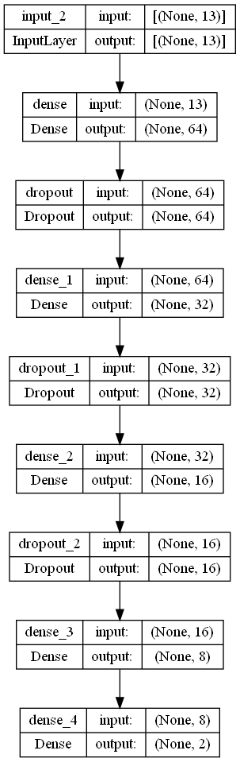
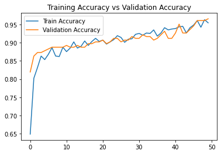
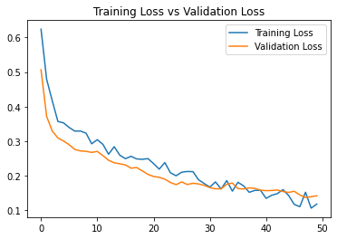
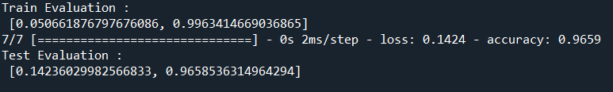

# Heart Disease Prediction Using FeedForward Neural Network (TensorFlow)

## 1. Summary

The aim of this project is to create a deep learning model to predict whether a patient has heart disease or not.

The model is trained with [Heart Disease Dataset](https://www.kaggle.com/datasets/johnsmith88/heart-disease-dataset) obtained from kaggle. The dataset consists of 2 classes which is 0 (no heart disease) or 1 (has heart disease).

## 2. IDE and Framework

This project is created using Spyder and Visual Studio Code as the IDE for the python and jupyter notebook respectively. The packages used in this project are Pandas, Scikit-learn, TensorFlow Keras and Matplotlib.

## 3. Methodology

### 3.1 Data pipeline

The data is first loaded and preprocessed to properly split them into features and labels. Then the data is split into train and test sets, with a ratio of 80:20.

### 3.2 Model pipeline

A feedforward neural network is constructed that is catered for classification problem. The structure of the model is fairly simple. Figure below shows the structure of the model.

The model is trained with a batch size of 16 and for 50 epochs. Early stopping and dropout is applied in this training to reduce overfitting. The training stops at epoch 24, with a training accuracy of 96% and validation accuracy of 94%. The results of the training process are shown in the graph below: 

## 4. Results

Upon evaluating the model with test data, the model obtain the following test results, as shown in figure below:

